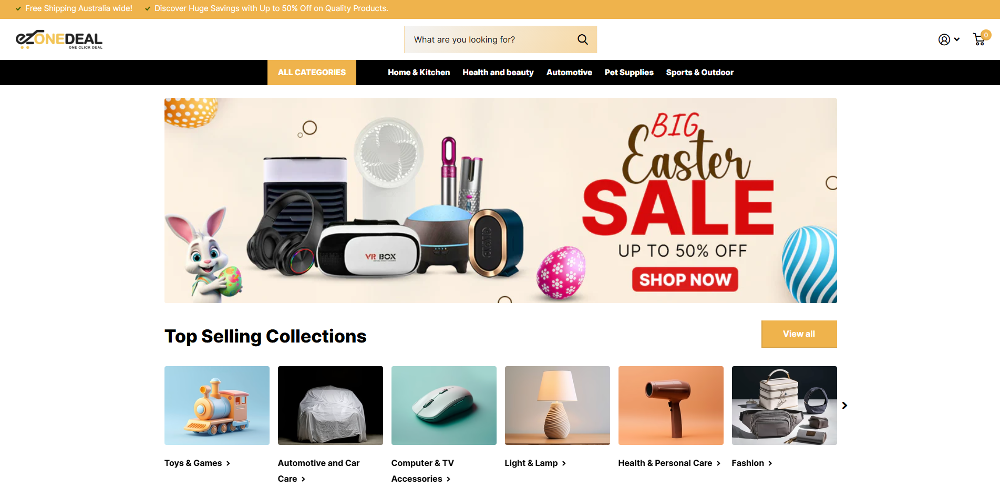

# EzoneDeal eCommerce

**Client:** 10x Digital Group  
**Website:** [ezonedeal.com.au](https://ezonedeal.com.au)  
**Tech Stack:** PHP, MySQL, WordPress, WooCommerce, Elementor, Astra Theme, Payment Gateway Integration

---

## 📦 Overview

**EzoneDeal** is one of Australia's reliable eCommerce platforms, offering over **1,400 budget-friendly products** across **12 diverse categories**. It serves as a one-stop online destination for Australians seeking **variety**, **value**, and **shopping convenience**.

---
## 🎯 Objective

To design and develop a **user-friendly**, **scalable**, and **visually appealing** eCommerce website that:

- Supports a broad range of products and categories.
- Enables seamless navigation.
- Provides a hassle-free shopping experience.

---
## ⚠️ Challenges

- **Design Complexity:** Crafting a clean, modern, and conversion-oriented UI in a highly competitive market.
- **Category Management:** Displaying a large product catalog in a structured and digestible format.
- **Performance:** Ensuring fast load times despite a high number of products.
- **Mobile Optimization:** Delivering a smooth experience across all mobile and tablet devices.

---
## 🛠️ Solution

- **WordPress + WooCommerce:** Built a robust backend for managing products, orders, and customer data.
- **Astra Theme + Elementor:** Implemented for a fast, responsive, and highly customizable frontend.
- **Custom Design Approach:** Employed minimalist, high-conversion UI/UX with clear visual hierarchy.
- **Payment Gateway Integration:** Enabled secure and user-friendly checkout with multiple payment options.
- **Performance Optimization:** Utilized caching, image optimization, and clean code to achieve fast load times.

---
## ✅ Results

- Developed a **responsive, fast-loading** eCommerce platform.
- Delivered a **seamless shopping experience** with easy navigation.
- Enabled effortless **scalability** for product offerings.
- Received **positive client and early user feedback** for both UI and performance.

